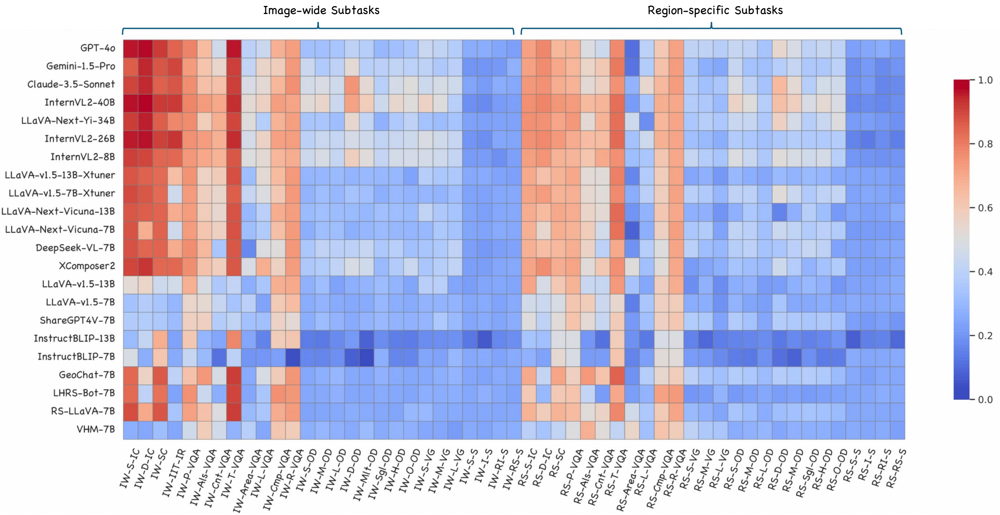

# RS-OmniBench: A Comprehensive Benchmark for Evaluating Large Vision-Language Models in Remote Sensing Imagery

  <a href="#quickstart"><b>Quick Start</b></a> |
  <a href="#introduction"><b>Introduction</b></a> |
  <a href="#evaluation"><b>Evaluation Results</b></a> |
  <a href="#leaderboard"><b>LeaderBoard</b></a> |
  <a href="#OmniBench"><b>RS-OmniBench Dataset</b></a>

## 📢 News
We are excited to announce that the dataset and code for this project will be made publicly available 
immediately upon the acceptance of the paper. Stay tuned for updates!

## 💡 Introduction
RS-OmniBench is a comprehensive, large-scale benchmark designed to offer a holistic evaluation of Large Vision-Language Models (LVLMs) in the context of remote sensing imagery. The benchmark includes seven meta-tasks and 53 subtasks, addressing image-level, region-level, and pixel-level understanding.

With a total of 175K multiple-choice visual questions, RS-OmniBench rigorously evaluates the recognition, localization, and reasoning capabilities of LVLMs in remote sensing imagery.

## 📊 Evaluation Results
- An overview of 22 LVLMs evaluated in this study. This table is provided in the **Supplementary Materials** of the paper.

- Quantitative results for 22 LVLMs across seven core meta-tasks 
from three perspectives (image-level, region-level, and pixel-level) 
are summarized. Accuracy is the metric. The overall accuracy score 
is calculated across all data in RS-OmniBench. 
Bold indicates the best performance in each column, 
and underline represents the second best.  

- Results of 22 LVLMs across 53 diverse subtasks: Horizontal axis representing subtasks ('IW-' for image-wide, 'RS-' for
region-specific) and vertical axis representing models. 
Current LVLMs exhibit limitations across a wide range of subtasks (blue region).  

- Model performance comparison on seven meta-tasks.
Bold indicates the best performance in each column, and
underline represents the second best. This table is provided in the **Supplementary Materials** of the paper.

## 🎖️ Leaderboard
-  The leaderboard displays the performance of the 22 LVLMs evaluated in our study. 
On the left, we visualize the results of representative LVLMs across seven meta-tasks, while the right side highlights the overall ranking.  

## 🌠RS-OmniBench Dataset
- **Our RS-OmniBench dataset will be made publicly available immediately upon acceptance of the paper**. 
The following outlines the composition of our dataset.

## 🚀 Quick Start
**📰 Important Notice:**  
The full code and reproduction workflow will be made publicly available immediately upon the acceptance of the paper. Stay tuned for updates!

[//]: # (To get started quickly, follow these steps:)

[//]: # ()
[//]: # (1. Clone the repository)

[//]: # (2. Install the necessary dependencies)

[//]: # (3. Run the example script)

#### 🔝 [Back to Top](#top)